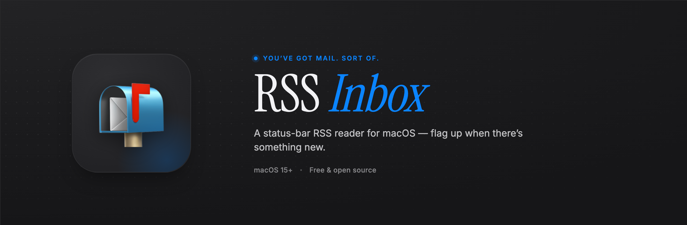

<p align="center">
  
</p>

<p align="center">
  
  
  <a href="LICENSE"></a>
</p>

<p align="center">
  <b>A quiet RSS reader that lives in your menu bar.</b><br/>
  No accounts. No sync. No subscriptions. Just feeds.
</p>

## Features

- 🗞️ **Menu bar resident** - no Dock icon, no windows in your way
- 📬 **The mailbox tells you** - the menu bar emoji flips when there's something new to read
- 📥 **Skim-friendly popover** - feed tabs, per-feed unread counts, full-row article links
- 🔄 **Background polling** - every 5, 15, 30, or 60 minutes
- 📂 **OPML in & out** - bring your feeds with you
- 🚀 **Sensible defaults** - launch at login, retention pruning, local-first SwiftData persistence

## Screenshots

<p align="center">
  
  &nbsp;&nbsp;
  
</p>

## Install

**[⬇ Download the latest DMG](https://rss-inbox.szarbartosz.com)** — requires macOS 15+.

<details>
<summary>Or build from source</summary>

Requires Xcode 16.

```bash
xcodegen generate
open RSSInbox.xcodeproj   # ⌘R to run
```

</details>

<details>
<summary><b>Architecture &amp; design notes</b></summary>

```text
RSSInbox/
├── AppDelegate.swift          NSPanel-backed status bar UI
├── RSSInboxApp.swift          SwiftUI App entry point
├── Core/
│   ├── FeedParser.swift       RSS 2.0 + Atom → ParsedFeed
│   ├── OPMLParser.swift       OPML import / export
│   ├── FeedPoller.swift       @Observable @MainActor polling loop
│   └── BadgeController.swift  Unread-count → status-bar icon
├── Models/
│   ├── Feed.swift             @Model — title, url, lastFetched, fetchError
│   └── Article.swift          @Model — guid, title, summary, link, isRead
└── Views/
    ├── PopoverView.swift      Menu-bar popover
    ├── ArticleRowView.swift   Full-row clickable article cell
    ├── ReaderView.swift       In-app reader (optional)
    └── PreferencesView.swift  Feeds + General tabs
```

- **`NSPanel` instead of `NSPopover`** — borderless, non-activating, manually positioned so the popover anchors to the status item across multi-monitor setups.
- **`maskImage` for rounded corners** — `NSVisualEffectView` ignores `layer.cornerRadius` during certain compositing passes; a 9-part stretchable mask image survives the redraws.
- **One `ModelContext` per logical owner** — the poller creates its own context per run; views use the SwiftUI environment context. SwiftData merges via the shared `ModelContainer`.

### Configuration

| Key                   | Type | Default | Description                 |
| --------------------- | ---- | ------- | --------------------------- |
| `pollIntervalMinutes` | Int  | `15`    | Background polling interval |
| `retentionLimit`      | Int  | `100`   | Max articles kept per feed  |

### Tests

```bash
xcodebuild test -scheme RSSInbox -destination 'platform=macOS' \
  CODE_SIGN_IDENTITY="" CODE_SIGNING_REQUIRED=NO
```

Covers OPML parsing, feed parsing (RSS 2.0 + Atom), the badge controller, and feed-poller integration (dedup, retention, network failure surfacing).

</details>

## License

[MIT](LICENSE) © Bartosz Szar
